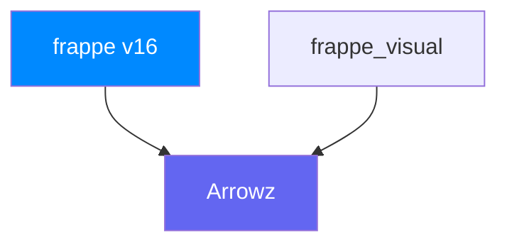

# Arrowz — Dependency Graph
# أروز — مخطط التبعيات

```mermaid
graph TD
    frappe["frappe v16"]
    frappe_visual["frappe_visual"]
    arrowz["Arrowz"]
    frappe --> arrowz
    frappe_visual --> arrowz
    style arrowz fill:#6366F1,color:#fff
    style frappe fill:#0089FF,color:#fff
```
