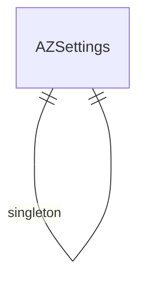

# Arrowz — Entity Relationship Diagram
# أروز — مخطط العلاقات

> 92 DocTypes

> **Note:** This is a placeholder ERD. Update with actual DocType relationships from the JSON definitions.
> Run: `ls arrowz/arrowz/*/doctype/` to discover all DocTypes and their Link fields.
